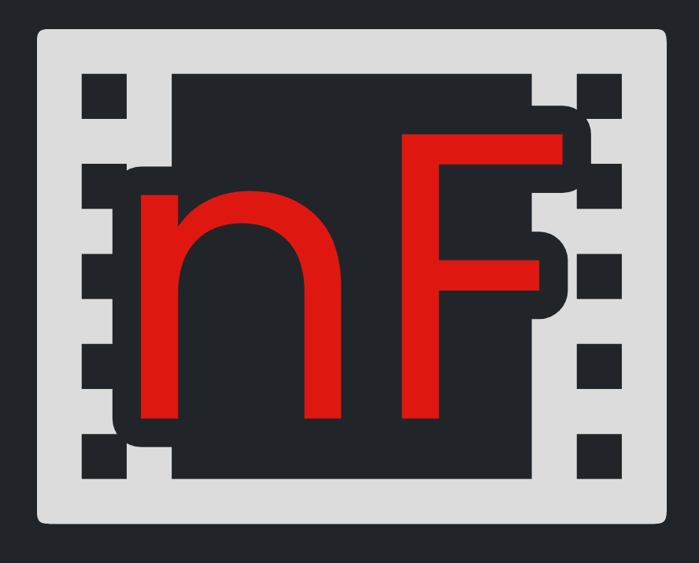
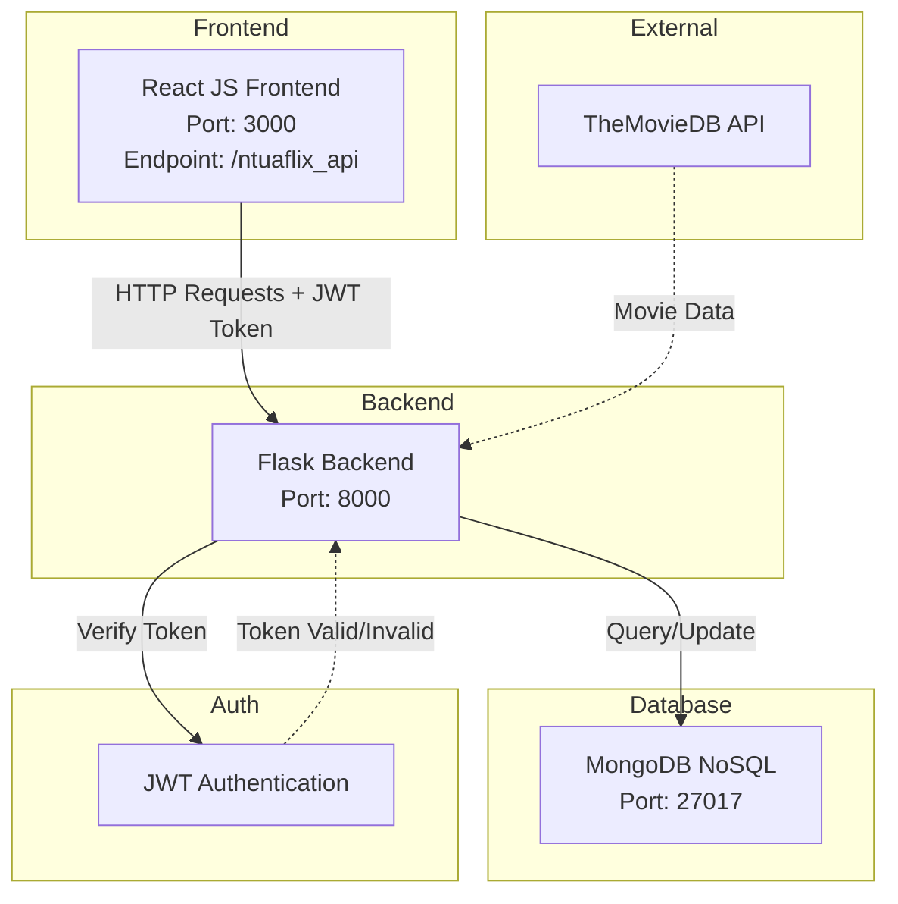
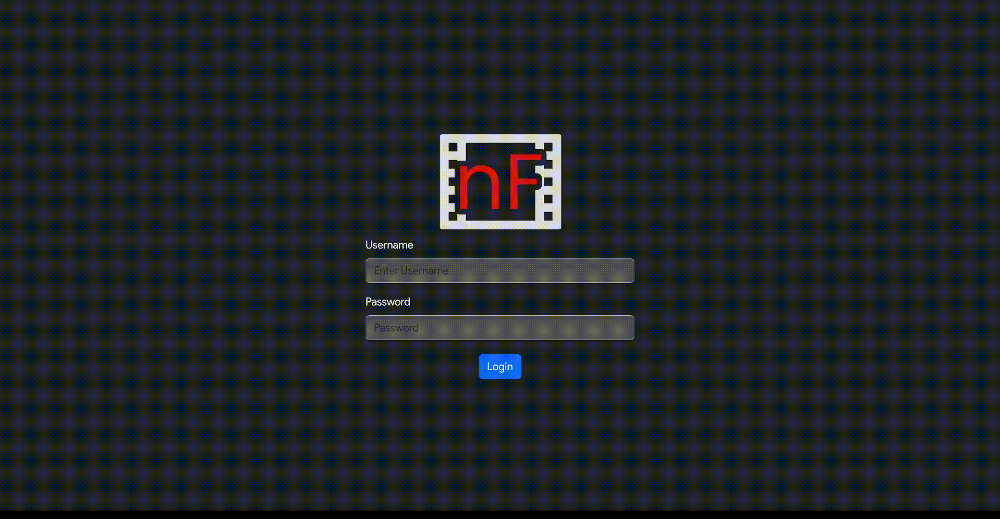

# NTUAflix

<div align="center">
  
</div>

## About
Ntuaflix is a movie database platform that allows users to browse and search film information freely. Users can also create personal libraries where they rate movies they've watched. The project was created as a semester assignment for the Software Engineering course in the Electrical and Computer Engineering Department at the National Technical University of Athens.

The project uses themoviedb API to fetch movie info, so you must obtain an API KEY from www.themoviedb.org to use the service.

## Architecture




## Features

- Movie info 
- Personal library of movie you've seen with rating capability.
- Visually pleasing UI

## Install backend packages and node-modules

```bash
bash install.sh
```

## For mongodb import (must have mongo service running)

```bash
bash db.sh
```
### Run the app:

1. Run back-end: <br />
``` cd back-end/ ``` <br />
``` python3 app.py ```

2. Go to home directory:
``` cd .. ```

3. Run front-end: <br />
``` cd front-end/ ```<br />
``` npm start ```

### You will be greeted in your browser by the login page, the front-end is running at:
``` localhost:3000/ntuaflix_api ```

###
<div align="center">
  
</div>

## License
MIT License

Copyright (c) 2024 DimitriosKakouris
